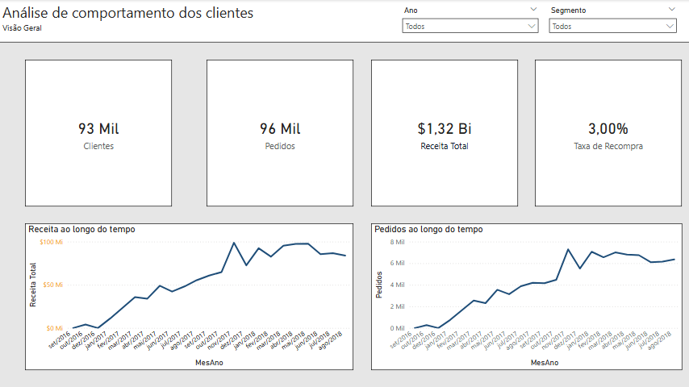
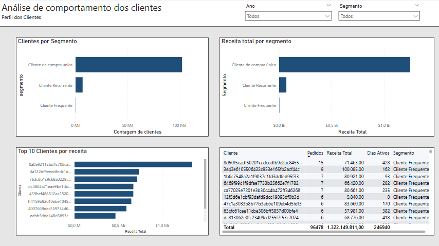

# Análise do comportamento e da retenção dos clientes

## Overview
Este projeto analisa o comportamento de clientes em um dataset de e-commerce com foco em frequência de compra, retenção e concentração de receita.

O objetivo é ir além de análises básicas de vendas e entender como os clientes se comportam ao longo do tempo.

## Dashboard

O dashboard final foi desenvolvido no Power BI com foco em visão executiva e análise do perfil dos clientes.

### Visão Geral


### Perfil dos Clientes


## Objetivo

O projeto busca responder perguntas como:

- quantos clientes compram apenas uma vez
- quantos voltam a comprar
- como a receita evolui mês a mês
- quais clientes concentram a maior parte da receita
- como resumir o comportamento do cliente em uma camada analítica simples e reutilizável

## Dataset

Brazilian E-Commerce Public Dataset (Olist) - https://www.kaggle.com/datasets/olistbr/brazilian-ecommerce

Contém dados de pedidos, clientes e transações.

## Tecnologias utilizadas


## Estrutura do projeto

```text
customerBehaviorAnalysis/
├── assets/
│   └── images/
│       ├── visão-geral.png
│       └── perfil-dos-clientes.png
├── data/
│   ├── olist_orders_dataset.csv
│   ├── olist_order_items_dataset.csv
│   ├── olist_customers_dataset.csv
├── python/
│   ├── export_powerbi.py
│   └── analysis.py
├── sql/
│   ├── create_tables.sql
│   ├── importData.sql
│   └── base.sql
└── README.md
```
## Como executar

### 1. Criar o banco de dados

Crie um banco PostgreSQL com o nome `ecommerce`, ou ajuste os parâmetros de conexão de acordo com o seu ambiente.

### 2. Configurar as variáveis de ambiente

O script Python utiliza as seguintes variáveis de ambiente para conexão com o banco de dados:

- `DB_USER`
- `DB_PASSWORD`
- `DB_HOST`
- `DB_PORT`
- `DB_NAME`

Você pode usar o arquivo `.env.example` como referência para essa configuração.

### 3. Instalar as dependências Python

` ```bash 
pip install -r requirements.txt `

### 4. Executar os scripts SQL na ordem correta

Primeiro, crie as tabelas no PostgreSQL:

create_tables.sql

Depois, importe os dados brutos:

importData.sql

Por fim, crie a camada analítica:

base.sql

### 5. Exportar as views analíticas

Depois de preparar o banco, execute o script responsável por exportar as views para arquivos CSV:

python python/export_powerbi.py

### 6. Validar os dados exportados

Para conferir a saída gerada e validar as principais tabelas analíticas:

python python/analysis.py

### 7. Construir o dashboard no Power BI

Com os arquivos CSV gerados na pasta data/, importe os dados no Power BI e utilize-os na construção do dashboard final.

## Análises realizadas

A etapa em SQL foi responsável por estruturar a base analítica do projeto. Primeiro, foram criadas no PostgreSQL as tabelas que armazenam os dados de clientes, pedidos e itens dos pedidos. Em seguida, os arquivos CSV do dataset da Olist foram importados para o banco. Com os dados carregados, foi construída uma camada analítica por meio de cinco views. A `fact_sales` consolida pedidos, clientes e itens, considerando apenas os pedidos entregues. A `customer_summary` resume o comportamento de cada cliente a partir do número de pedidos, da receita total, da primeira e da última compra, além de classificá-los em perfis como compradores de compra única, recorrentes e frequentes. A `monthly_sales` apresenta a evolução mensal de pedidos, clientes e receita. A `customer_revenue_rank` organiza os clientes por receita e calcula sua participação acumulada no faturamento total. Por fim, a `repeat_rate` sintetiza a taxa de recompra da base.

No Python, o projeto foi usado em duas frentes. A primeira foi a conexão com o PostgreSQL por meio do SQLAlchemy para exportar as views analíticas em arquivos CSV, deixando os dados preparados para consumo em outras ferramentas. A segunda foi a leitura desses arquivos com Pandas para uma validação inicial dos resultados, permitindo inspecionar as tabelas geradas, conferir os clientes com maior receita, observar a taxa de recompra e verificar o comportamento das vendas ao longo do tempo.

No Power BI, os dados exportados foram utilizados para a construção de um dashboard interativo voltado à análise do comportamento dos clientes. A visualização reúne indicadores como frequência de compra, segmentação por recorrência, tempo de atividade do cliente, evolução das vendas ao longo do tempo, concentração de receita por cliente e taxa de recompra, permitindo transformar a camada analítica construída em SQL em uma leitura mais clara e visual dos resultados.

## Principais insights

A análise mostrou uma base com aproximadamente 93 mil clientes e 96 mil pedidos, o que já indica uma relação relativamente baixa entre clientes e recompra. Esse comportamento aparece de forma ainda mais clara na taxa de recompra, de 3,00%, sugerindo predominância de clientes de compra única. Também foi possível observar concentração de receita em um grupo reduzido de clientes com maior faturamento, além de uma trajetória de crescimento nas vendas ao longo do período analisado, especialmente entre 2017 e 2018.
